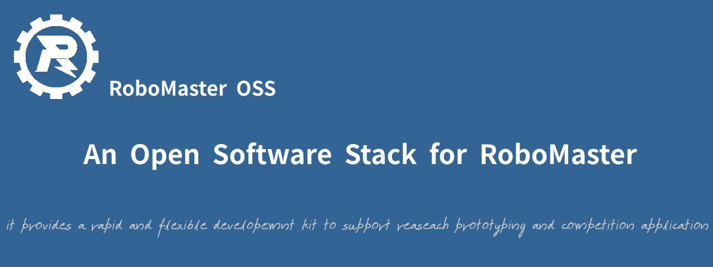

# Documents Web for RoboMasterOSS  




RoboMasterOSS是一个面向RoboMaster的开源软件栈项目，目的是为RoboMaster机器人软件开发提供了一个快速的，灵活的开发工具，支持算法原型研究和robomaster比赛应用开发。

* 该文档采用[docsify](https://github.com/docsifyjs/docsify)工具构建

## 1.本地环境测试

```bash
#安装docsify-cli
npm i docsify-cli -g
#下载代码，并进入主目录
https://github.com/robomaster-oss/robomaster-oss.github.io.git
cd robomaster-oss.github.io
#运行服务器，访问地址为http://localhost:3000
docsify serve docs
```

## 2.文档结构

* Get Started
* Tutorials
* Developers Guide
* Resources
* Contribution
* About Us