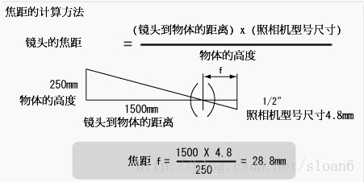

# RM相机选型指南

相机设备是RoboMaster比赛中的基础设备，例如自瞄技术，能量机关技术都依赖于相机设备，相机的好坏直接影响到算法的性能，所以其选型非常重要，本文将分成两个部分介绍相机的选型，一个是相机机型（感光部分）的选择，二是镜头的选择。该部分仅供参考。

#### 相机机型选择

我们所用的相机主要有两大类

- 普通usb相机（以ov2710型号为例）
- 工业相机

**普通ov2710相机特点**

- 优点：
  - 价格便宜，（单价100-200左右）
  - 分辨率高，最高分辨率可达1080P
  - 重量轻型，易安装。
  - 开发简单。
- 缺点：
  - 在高分辨率的情况下，图像采集帧率不高，只有30fps，即刷新速度不高.
  - 由于采用逐行曝光方式，拍摄运动物体，会有拖影和运动模糊现象。
  - 使用久后，相机性能下降，产生一定程度的颜色失真，图像噪声等问题。
  - 由于制造简单，仅一块电路板pcb板，加简单镜头，易损坏

**工业相机特点**

- 优点：
  - 消除运动模糊现象：由于工业相机可以采用全局曝光，即可以实现在拍摄运动物体过程中，或相机在运动过程中，以及相机抖动（云台抖动导致相机抖动）过程中，获得相对清晰的图像，以便图像处理
  - 分辨率高，帧率也高：由于工业相机采用usb3.0传输方式，传输带宽高，即可实现在高分辨率的情况下，达到比较高的帧率（刷新速度）。
  - 性能稳定，使用寿命长：工业相机的制造工艺比普通相机的制造工艺要高，且经过性能测试，性能比较稳定，且寿命长，甚至可以在恶劣的环境下使用。
- 缺点：
  - 价格相对较贵（单价1000-5000左右）。
  - 重量相对较重，安装占用空间大。
  - 驱动不通用，需要额外配置驱动。

> 品牌推荐：
>
> 工业相机可以考虑国产品牌，大华，大恒都是性价比不错的品牌。

**选型建议**

相机机型的选择，应该根据实际需求情况以及自身经费情况，不可盲目追求工业相机相机机型的选择，应该根据实际需求情况以及自身经费情况，不可盲目追求工业相机

#### 相机镜头选择

不同任务需要的镜头焦距是不一样的，如果我们要看近距离的目标，则短焦镜头好，如果需要看远距离目标，则长焦镜头好，如果要看的视角广，则需要鱼眼镜头，这里给出一个镜头焦距选择的简单方法。

焦距计算公式：（图片来源互联网，若侵联删）

**以RoboMaster2019能量机关任务为例**

具体计算：

- 风车半径为0.8m,则大小为1.6\*1.6m，需要图像留有余量，方便机器人对位，这里视野取目标的3倍，则视野大小应为4.8 \*4.8m。
- 大风车距离桥头（镜头）距离为8m
- 相机尺寸为4.8um\*1024=4.8mm

则 $\frac{800*4.8}{480}=8mm$ 
所以，最终，考虑选择8mm的镜头。