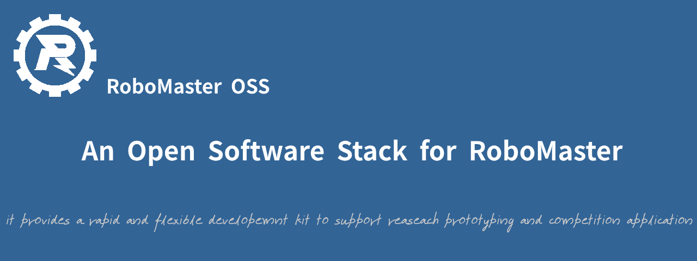

### 什么是RoboMasterOSS ?

**RoboMaster OSS（RoboMaster Open Software Stack，简称，RMOSS）**是为RoboMaster高性能计算平台软件开发提供快速开发工具的一个通用统一的`开源软件栈`。

* 提供RoboMaster相关的ROS2 metapackage/package：
  * rmoss_core提供了部分功能模块，如相机模块，弹道计算模块等，
  * rmoss_contrib提供了自瞄模块等。
* 提供了模块的设计架构，模块的组织方式，以及代码编程规范，是一个统一的软件架构。

> 关于RoboMasterOSS更多项目，见[Project](Get_Started/project)章节

特点：

- ROS2兼容（基于ROS2开发）：支持与ROS2其他功能包一起使用，如ROS2相关可视化工具。
- 高扩展性：乐高式组件开发，支持DIY开发。
- 文档支持：快速上手。

>  关于RoboMasterOSS更多特点，见[Feature](Get_Started/feature)章节

在RoboMaster比赛中，“机器视觉”，“自主导航”等相关内容涉及到高性能计算平台编程，RoboMasterOSS就是针对高性能计算平台编程的。

>  **高性能计算平台编程**：
>
> - 区别于嵌入式控制编程，高性能计算平台编程一般使用性能相对较好的单板计算机或mini PC作为开发平台， 例如manifold2， tx2， NUC， hikey970， 树莓派等。
> - 因为“机器视觉”，“自主导航”等算法需要较高的计算性能支持，嵌入式处理器无法处理。一般来说，嵌入式控制编程比较底层，直接涉及到机器人执行机构和大部分传感器。
> - 简单点说，嵌入式控制编程是底层软件开发，高性能计算平台编程是上层软件开发，在机器人开发中，两者各有分工，并通过[基本通信](Tutorials/beginner_rm_base.md) (rm_base模块)联系在一起。
>

### 适用场景

RoboMasterOSS 适用以下场景的高性能计算平台软件开发：

* RoboMaster对抗赛
* RoboMaster ICRA AI挑战赛
* RoboMaster大学生 夏令营
* RoboMaster中学生 夏/冬令营

RoboMasterOSS提供了许多开发模块，以及开发工具，为搭载高性能计算平台的RoboMaster机器人的 **软件快速开发** 提供支持。

以上，是RoboMasterOSS的主要开发场景，也是RoboMasterOSS后续开发和维护的方向。

### 目标

RoboMasterOSS 只有一个目的，**加速开发**。

* 降低协作成本：统一架构
  * RMOSS 提供了一个统一的架构，以及开发规范，避免了多人协作带来的移植难度。
* 降低开发成本：复用模块
  * rmoss_core 具备丰富的**基础模块** 。ROS2本身具有丰富的基础模块和强大的调试模块。
  * 兼容ROS2，所以可以充分利用其他基于ROS2的项目加速开发，如SLAM相关功能包。
* 快速上手，适合新手：丰富的文档
  * RMOS具备详细的文档支持，包含RoboMaster机器人开发流程样例，以及一些开发技巧，加速开发，对于新手来说，非常适合。

### 设计参考

* 基于ROS的设计方式
* 参考了[RoboRTS][4]的设计方式

> RoboRTS项目
>
> * RoboRTS项目是RoboMaster官方为RoboMaster人工智能挑战提供的开发样例。其中具有很多不错的设计思路，RMOSS中很多项目的设计思路就是参考RoboRTS，不过由于RoboRTS针对于全自动机器人，其功能针对于RoboMaster人工智能挑战赛，这是它的局限性。RMOSS目的是提供一个更为广泛的功能软件栈，这是不满足于RoboRTS提供的功能。

 

[2]: https://www.robomaster.com
[4]: https://github.com/RoboMaster/RoboRTS