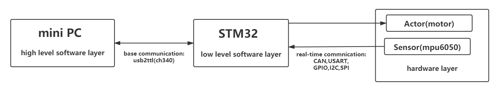

# 6.机器人基本通信

### 机器人软件分层模型

在实际机器人开发中，对于简单的机器人，软件部分只涉及嵌入式开发，对于复杂的机器人，需要强大的算力支持，如涉及视觉处理，复杂人机交互，需要高性能的计算机进行处理，所以此时的软件模型一般分为上层软件（高级通用编程，在通用计算机平台上运行）和底层软件（嵌入式编程，在嵌入式平台上运行）。而上层软件与底层软件的联系与交互，就依靠通信实现，也就是所谓的`基本通信`。以下为一个简单的分层模型示意图：



### 基本通信

robot_base是RMOS中的基本通信模块，实现了RMOS与机器人嵌入式底层通信功能，RMOS可以通过robot_base获取机器人的一些底层数据，也可以通过robot_base控制机器人做出一些动作。

robot_base中具有一个简单开发样例，可以方便大家进行开发学习。实现了以下功能:

- 接受:  接收机器人嵌入式底层（实际上是操作手）发送过来的控制命令。
- 发送:  给机器人嵌入式底层发送云台控制指令。

### 环境准备

模块依赖：

- robomaster_os（metapackage）
  - robot_cam
  - robot_msgs
- rmos_example（metapackage）
  - standard_robot_example

### robot_base模块

robot_base支持三种程度的自定义开发:

- **底层自定义开发**:传输设备自定义开发，数据包格式自定义开发。
- **封装自定义开发**:对底层的封装模块自定义。
- **顶层自定义开发**:只需要开发如何处理接收到底数据，以及发送何种数据即可。

更多内容参考robot_base。

### standard_robot_base模块

不同的机器人，与底层通信协议是不一样的，需要根据需要定义专用的通信协议，这里以standard_robot_example / standard_robot_base为例子进行说明自定义robot_base模块。

#### 协议

* 参考standard_robot_base/doc/standard_protocol.md

#### 运行测试

运行base通信节点

```bash
roscore
rosrun standard_robot_example standard_robot_base_node 
```

测试客户端

```bash
rosrun standard_robot_example standard_gimbal_control.py
```

