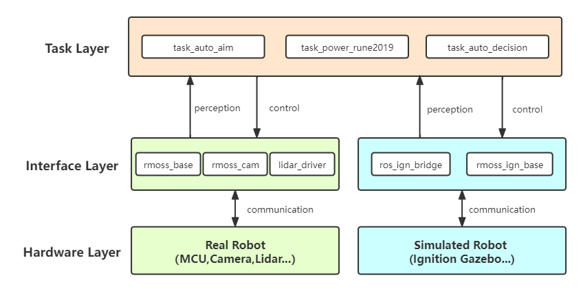
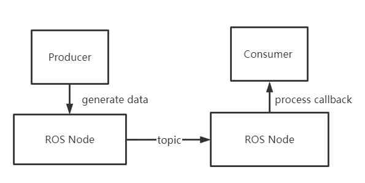
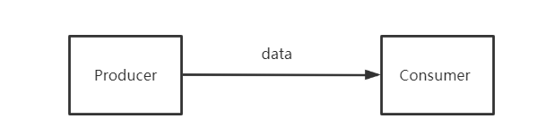

# RMOSS基本设计模式

对于一个RM机器人，可能需要实现多种功能，从系统的角度来说，RM机器人软件系统是一个复杂系统，需要对其进行解耦模块化，才能高效进行开发。按照功能对系统进行解耦，每个功能作为单独一个节点，即模块化解耦，如自瞄功能模块，能量机关功能模块，自动决策功能模块等。RMOSS项目基于ROS2实现，也就是说每一个模块应该为一个独立的ROS2 package结构。

### 1. 系统架构

在RM机器人开发中，需要接触一些硬件（传感器，电机等），例如，我们需要从一些传感器获得数据，也需要给一些执行器发送指令，这些与硬件打交道的开发，我们就做接口（也可以叫做驱动），接口层将屏蔽硬件细节，使得我们在实现算法的时候直接使用接口，无需关心硬件。因此，我们把系统分为三层，首先硬件部分为硬件层（Hardware Layer），与硬件打交道的是接口层（Interface Layer），利用算法实现具体功能任务的是任务层（Task Layer）,示意框图如下图所示。

各个模块解耦，方便模块化测试，特别是任务层的算法部分不受具体硬件的影响，可以被方便的复用。在进行机器人开发过程中，使用仿真可以加速我们的开发，我们可以在仿真环境中进行一些初步的程序测试与算法验证，RMOSS项目提供了基于Ignition Gazebo仿真的软件栈（[rmoss_ign](https://github.com/robomaster-oss/rmoss_ign)）,该系统架构同样适用于仿真机器人，我们只需要为仿真机器人实现相应的接口即可。

### 2. 任务模块与C/S模型

对于RM机器人，会涉及多个不同功能，对应不同的功能任务模块，每个任务模块独立运行，通过ROS通讯机制耦合在一起，构成一个复杂系统。为了更好的管理这些模块，需要对模块进分类，根据功能任务流程可分为三种模块类型：`接口任务模块`， `功能任务模块`，`决策任务模块`。

接口任务模块 ：面向机器人底层，负责处理机器人传感器数据与执行指令数据

* 单板计算机（NUC）控制机器人实际上是通过通信完成的，具体实现实际上是在mcu（stm32）上。主要任务是接收其他节点的控制指令，发送来自mcu的传感器数据（如陀螺仪，电机编码器，裁判系统数据等）给其他节点。除此之外，根据需要对数据进行相应的预处理，如数据滤波等。
* 实时性要求高
* 对应`rmoss_base`，`rmoss_cam`等模块。

功能任务模块 ：面向机器人具体功能任务实现，一般每个子任务之间相互独立。

* 机器人核心功能任务，如自动瞄准，能量机关等等，这些任务一般相互独立，可以解耦成独立模块，这些模块的输入来自于传感器（相机，来自`rmoss_base`的底层数据等），然后将结果与控制指令发送给`rmoss_base`或决策模块。
* 实时性要求较高（通过增加预测滤波进行补偿）
* 对应`rmoss_auto_aim`，`rmoss_poswer_rune2019`等模块。

决策任务模块 ：面向机器人全局决策，管理并利用控制任务与功能任务的模块节点，实现机器人的整体功能。

* 对于全自动机器人，需要一个决策节点，负责全局的决策，以及对其他功能任务节点进行管理，如如设备监控节点，预警节点，信息记录节点。决策任务赋予机器人智能，使得机器人更好的人机交互或自主行动。
* 实时性要求低

在对系统进行解耦分层后，这些模块需要一起工作，实现最终的系统，为了方便这些节点可以有条不紊的一起工作，采用`C/S服务架构`，即除了决策任务的其他任务，都作为一项服务，通过决策任务管理并控制这些任务，可采用ROS2中service通信方式实现。即控制任务/功能任务采用service方式，对外提供服务，决策任务通过service控制并管理这些服务，使得决策节点获得这些服务的能力。

这里采用ROS2 service进行的简单任务管理，只定义`RNNNING`,`IDLE`,`ERROR`三个任务状态, 定义`START`,`STOP`两个基本控制命令。这些状态与控制命令在`rmoss_interfaces`中定义: `GetTaskStatus.srv`, `ControlTask.srv`。

* `START`命令：`IDLE`->`RNNNING` 。
* `STOP`命令：`RNNNING`->`IDLE` 。
* `ERROR`表示任务节点启动失败，或者运行时设备断开连接等错误导致任务不能正常工作，尽可能尝试自我修复。

> Tip：相比于`rclcpp_lifecycle`提供的支持生命周期管理的ROS节点`LifecycleNode`方式，该方式更加简单。`LifecycleNode`方式支持状态更多，使用更加灵活，对资源管理更加精细，但使用起来略显繁琐。

### 3.ROS解耦设计

RMOSS采用ROS2 package方式进行模块化，但是对于一个模块实现的时候，需要采用算法与ROS分离的原则，即ROS解耦涉及。对于一个功能模块，应该包含以下两部分：

* 算法/驱动实现部分：具体算法实现，与ROS无关的代码部分，需要与ROS解耦。
* ROS顶层部分：ROS顶层设计，调用算法层，以及通过ROS通信机制，与其它模块建立连接，实现具体功能。

> 对于一些只有算法的模块，可能没有ROS顶层部分，如`rmoss_projectile_motion`.

例如，对于生产者-消费者问题，分为创建消费者模块和生产者模块，如下图所示，采用ROS解耦设计，`Producer`和`Consumer`只需要考虑自身功能，无需关心通信问题，也无需关心同步，资源互斥等问题，ROS顶层部分只涉及通信，将消费者模块和生产者模块联系起来。

这么设计的好处是可以实现快速的`去ROS操作`。ROS2的便利的通信机制可以加速我们程序的原型开发，但是ROS2的通信机制带来的额外运行时系统开销，如果我们追求极致的性能，我们可以为自己的程序专门设计一套系统，去掉`ROS2`这个中间件带来的额外系统开销。例如，对于上一个例子，如果我们只有一个生产者和一个消费者，我们可以考虑`去ROS操作`，去掉ROS顶层，直接调用`Producer`和`Consumer`，如下图所示。当然实际生产者和消费者问题会更加复杂一点，消费者和生产者应该分别采用一个线程，然后利用信号量，锁等机制保证线程同步与资源互斥。

> Tip: `去ROS操作`是指不使用ROS2的通信机制，目的是减小ROS2带来的额外运行时系统开销，但依然可以使用ROS2的编译系统。
>
> ROS2的通信机制（基于DDS）是一个通用的进程间通信解决方法，能够实现多对多通信，会涉及消息的序列化和反序列化，这样通用性设计的代价就是牺牲一定的性能，当然ROS2提供了Composition机制，可以一定程度上减小通信带来的系统开销。

这个解耦设计虽然提供了`去ROS操作`的方案，但是在实现一些复杂场景功能时，自己的开发的非ROS系统的性能不一定比ROS性能高多少，甚至还可能降低性能。我们需要在性能和通用性上进行权衡，可以考虑局部`去ROS操作`，比如，我们可以将两个模块通过ROS解耦设计合成一个模块，使用一个ROS节点，而不是将所有模块进行`去ROS操作`，这样避免了自己设计复杂系统的同时，也能通过`去ROS操作`降低一定的ROS运行时开销，提高性能。
