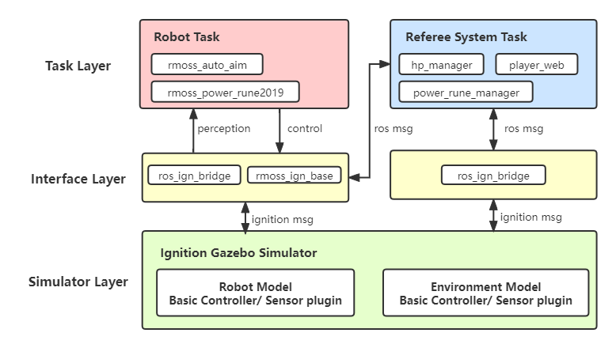

# RMOSS Ign设计模式

[rmoss_ign](https://github.com/robomaster-oss/rmoss_ign)是基于Ignition Gazebo为RoboMaster开发的仿真器项目。仿真机器人环境可以让我们缺少真实机器人或真实场地时，也能够够进行相应机器人算法软件开发，我们可以在仿真环境对我们的机器人算法进行初步验证，甚至构建完整的比赛仿真器，用于操作手的对战训练。相比于真实机器人，使用效率高，可不间断使用，即使我们拥有真实机器人的情况下，我们仍然可以利用仿真机器人用于我们的机器人开发，比如进行机器人AI训练，或做一些算法的自动化测试。总得来说仿真机器人不可替代真实机器人，但是仿真机器人可以在机器人开发中提高我们的开发效率，在算法初步验证，自动化测试，AI训练，操作手模拟训练等方面有着重要用途。

>  [Ignition Gazebo](https://ignitionrobotics.org/) 是一款开源的机器人仿真器，包含了一系列构建仿真的工具，是基于上一代Gazebo仿真器的重构版本，对ROS兼容友好，并对多机器人仿真支持较好，目前还在快速开发中。

### 1.系统架构

rmoss_ign系统架构保持和[RMOSS基本设计模式](https://robomaster-oss.github.io/rmoss_tutorials/#/design/rmoss_design)一致，同样可分为三层，Simulator层（对应真实机器人硬件层），Interface层，Task层，然后Task层运行在ROS上，可分为机器人任务和裁判系统任务，接口层运行ROS之上，但是也可以与仿真器进行通信，Simulator层和Task层通过Interface层解耦，考虑到ROS使用会更加灵活，在这个架构中，Ignition Gazebo仿真器尽量完成简单的与仿真密切相关的任务，而复杂的任务逻辑都在Task层（ROS）进行处理。

对于Ignition Gazebo层，我们需要实现基本的机器人和场地仿真模型，Ignition Gazebo机器人仿真主要包括两部分：仿真建模和仿真插件。

- 仿真建模：首先需要对机器人进行3D建模，在sdf文件定义了模型的link与joint等信息。
- 仿真插件：作用于仿真模型，可与仿真器直接交互，给仿真模型施加力，获取仿真真模型状态等，实现机器人在仿真器中的感知，控制等功能。

对于接口层，主要采用topic通信的方式将Ignition Gazebo层和ROS任务层进行连接，这里的接口层，简单的只实现数据中继的功能（`ros_ign_bridge`），如相机传感器数据，激光雷达数据，电机控制指令等，复杂的会实现一些控制器逻辑（`rmoss_ign_base`），比如机器人底盘云台控制器，实现对机器人的底盘跟随云台控制等多种模式。

对于任务层，机器人任务与真实机器人开发中的任务模块一致，使得可以方便进行算法在仿真环境中的验证与自动化测试，对于裁判系统，主要的任务逻辑都在ROS层实现，利用python可以灵活的实现裁判系统逻辑，完成完整比赛仿真。

### 2.模型

采用[xmacro](https://github.com/gezp/xmacro)方式进行sdf模块化建模，裁判系统模块统一采用标准模型（`rmoss_ign_resource`），其他机器人应该复用这些模块，保证裁判系统一致。

进行SDF建模应该尽可能遵守以下几个原则：

* `插件分离原则` : 使用`xmacro`进行模块化时，插件应该和模型分离，这样方便使用自定义的插件作为控制器。
* `Collision简洁原则`：在构建机器人`<collision>`时，尽可能采用简单的几何（如`box`，`cylinder`, `sphere`）代替复杂`mesh`文件，必要时可以忽略部分collision，减小仿真计算量。

### 3.控制器

在完成仿真机器人模型和比赛场地模型的构建后，我们需要对机器人进行控制，也需要裁判系统对比赛过程进行监控，这个时候就需要一些控制逻辑了，实现控制逻辑可分为两层，第一层是Ignition Gazebo插件，第二层是ROS控制节点。Ignition Gazebo插件尽量完成简单的控制任务，基于Ignition Gazebo插件提供的基本控制接口，复杂的控制任务应该可以在ROS上进行。

* Ignition Gazebo插件：实现机器人在仿真器中的感知，控制等基本功能，如电机控制，灯条颜色切换，射击子弹。
* ROS控制节点：Ignition Gazebo插件只完成基本的控制，而复杂控制逻辑应该在ROS层进行，如底盘跟随云台控制器，能量机关控制逻辑。

这样的分层可以让我们灵活的调整裁判系统功能，对于下一年的比赛新规则发生了变化，这种设计可以不用改变Ignition Gazebo插件，可以继续用之前的Ignition Gazebo插件，只改变ROS控制节点即可，比如2021年的能量机关，只是改变大风车旋转的速度，我们可以只改变ROS控制节点即可。这里有两个控制器分层设计的例子：

* 对于机器人控制，如底盘控制，仿真器Ignition Gazebo只提供底盘控制和云台电机控制基本控制接口，通过`ros_ign_bridge`与ROS建立连接，在ROS层实现了更高级的底盘跟随云台控制。
* 对于场地模型控制（或裁判系统），如能量机关，仿真器Ignition Gazebo只提供指示灯与电机控制接口，通过`ros_ign_bridge`与ROS建立连接，具体的能量机关亮灯逻辑和转动逻辑在ROS层实现。

### 4.裁判系统

类似于控制器分层设计，需要使用Ignition Gazebo插件与仿真器直接交互，从仿真器获取直接数据（如机器人速度，机器人位置等），但是具体的复杂逻辑应该使用ROS节点方式完成，如进行血量管理，判定超速，判定激活能量机关成功，判定比赛结束等等。

裁判系统开发原则：

* 裁判系统使用的topic命名空间应该为`/referee_system`。
* 裁判系统建议采用python实现（使用方便）。

