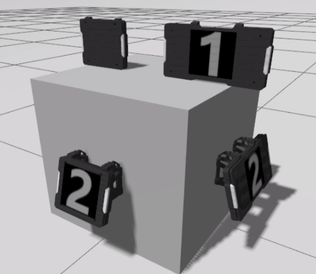
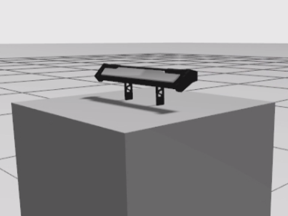
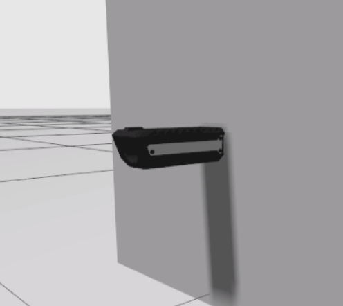

# RMOSS Ign建模指南

[rmoss_ign](https://github.com/robomaster-oss/rmoss_ign)项目是基于Ignition Gazebo为RoboMaster提供仿真支持的功能栈，Ignition Gazebo机器人仿真主要包括两部分：仿真建模和仿真插件。

* 仿真建模：首先需要对机器人进行3D建模，在sdf文件定义了模型的link与joint等信息。
* 仿真插件：作用于仿真模型，可与仿真器直接交互，给仿真模型施加力，获取仿真真模型状态等，实现机器人在仿真器中的感知，控制等功能。

rmoss_ign_resources为RoboMaster Ignition Simulator提供了一些公共基本模型资源，包括以下3种类型：

* 裁判系统模块组件：装甲板模块，枪口测速模块，指示灯模块等
* 标准射击弹丸：17mm荧光弹，42mm荧光弹
* 标准机器人：RoboMaster University AI Challenge2019标准步兵机器人模型

rmoss_ign_plugins为RoboMaster Ignition Simulator提供了一些公共基本控制器（插件）

- MecanumDrive: 麦克拉姆轮插件，实现底盘全向移动功能。
- ProjectileShooter：子弹发射插件，实现射击功能。
- LightBarController: 灯条控制器，可动态改变灯条发光颜色，支持`none`,`red`,`blue`,`yellow`几种模式。

### 裁判系统3D模型使用

采用[xmacro](https://github.com/gezp/xmacro)方式定义了宏模块，可以方便的被复用。

* rm21_armor_module（装甲板模块）：`small_armor`, `large_armor`, `small_armor_with_support`, `large_armor_with_support`
* rm21_light_indicator_module（灯条指示模块）：`light_indicator` 
* rm21_speed_monitor_module（枪口测速模块）：`speed_monitor_17mm`, `speed_monitor_42mm`（TODO）

- rm21_video_transmitter_module（图传模块）：`video_transmitter` (TODO)
- rm21_rfid_interaction_module（RFID模块）：暂不考虑，需要等待Ignition Gazebo的支持。

遵循`插件分离`的原则，这些模块都不包括插件部分，仅仅为3D模型搭建，定义连杆，关节等信息。

> 对于`rm22_`系列裁判系统模块，使用方式基本与`rm21_`相同，对于相同的模块不再详述，对于不同的模块会直接单列出来。

#### rm21_armor_module模块

装甲板模块，提供`small_armor`, `large_armor`, `small_armor_with_support`, `large_armor_with_support`四个xmacro宏定义，该xmacro定义一组link和joint，如果需要在一个model下使用多个模块，需要使用`suffix`避免重名。



```xml
<!--首先需要include相应模块定义 -->
<xmacro_include uri="model://rm21_armor_module/rm21_armor_module.def.xmacro" />
<!--然后使用相应模块即可 -->
<!--sticker_type目前支持num1,num2,如果为空，则表示没有贴纸，贴纸种类后续将继续增加 -->
<xmacro_block name="small_armor" suffix="_1" parent="base_link" sticker_type="" pose="0 -0.15 0.2 0 0 0"/>
<xmacro_block name="large_armor" suffix="_2" parent="base_link" sticker_type="num1" pose="0 0.15 0.2 0 0 0"/>
<xmacro_block name="small_armor_with_support" suffix="_3" parent="base_link" sticker_type="num2" pose="0.2 0 0 0 0 0"/>
<xmacro_block name="large_armor_with_support" suffix="_4" parent="base_link" sticker_type="num2" pose="0 0.2 0 0 0 1.57"/>
```

* `small_armor`, `large_armor`：包含一个连杆`armor${suffix}`定义，模块的原点在底面中心
* `small_armor_with_support`, `large_armor_with_support`：包含两个连杆`armor${suffix}`和`armor_support_frame${suffix}`定义，模块的原点在支架背面的中心。

> Tip
>
> * 装甲板的判定击打的collision为`armor${suffix}/target_collision`
> * 装甲板灯条visual路径为`armor{suffix}/light_bar_visual`

#### rm21_light_indicator_module模块

灯条指示模块，提供`light_indicator` 一个xmacro宏定义。



```xml
<!--首先需要include相应模块定义 -->  
<xmacro_include uri="model://rm21_light_indicator_module/rm21_light_indicator_module.def.xmacro" />
<!--然后使用相应模块即可 -->
<xmacro_block name="light_indicator" suffix="" parent="base_link" pose="0 0 0.2 0 0 0"/>
```

* `light_indicator`：包含一个连杆`light_indicator${suffix}`定义，模块原点为底部支架中心

> Tip
>
> * 指示器灯条visual路径为`light_indicator${suffix}/light_bar_visual`

#### rm21_speed_monitor_module模块

枪口测速模块，提供`speed_monitor_17mm` 和`speed_monitor_42mm` (TODO) 2个xmacro宏定义。



```xml
<!--首先需要include相应模块定义 -->  
<xmacro_include uri="model://rm21_speed_monitor_module/rm21_speed_monitor_module.def.xmacro" />
<!--然后使用相应模块即可 -->
<xmacro_block name="speed_monitor_17mm" suffix="_1" parent="base_link" pose="0.2 0 0 0 0 0"/> 
```

* `speed_monitor_17mm`, `speed_monitor_42mm`：包含一个连杆`speed_monitor${suffix}`定义，模块原点为枪口背面中心，且原点位于枪管轴中心线上。

> Tip
>
> * 枪口测速器灯条visual路径为`speed_monitor${suffix}/light_bar_visual`。

### 控制器（插件）使用

* 注意，控制器目前还在开发中，后续可能变化较大。

#### MecanumDrive2插件

通过任意力施加在底盘上模拟实现麦克纳姆轮效果。

> 官方目前已经实现了MecanumDrive插件，基于摩檫力方式，效果会更加真实。

```xml
<plugin filename="MecanumDrive" name="ignition::gazebo::systems::MecanumDrive2">
    <chassis_link>chassis</chassis_link>
    <front_left_joint>front_left_wheel_joint</front_left_joint>
    <front_right_joint>front_right_wheel_joint</front_right_joint>
    <rear_left_joint>rear_left_wheel_joint</rear_left_joint>
    <rear_right_joint>rear_right_wheel_joint</rear_right_joint>
</plugin>
```

* 订阅控制的topic为`<model_name>/cmd_vel`，消息类型为`ignition::msgs::Twist`。

#### ProjectileShooter插件 

发射弹丸控件

```xml
<plugin filename="ProjectileShooter" name="ignition::gazebo::systems::ProjectileShooter">
    <shooter_name>small_shooter</shooter_name>
    <shooter_link>speed_monitor</shooter_link>
    <shooter_offset>0.15 0 0 0 0 0</shooter_offset>
    <projectile_velocity>20</projectile_velocity>
    <projectile_num>10000</projectile_num>
    <projectile_uri>model://rm_fluorescent_projectile_17mm</projectile_uri>
</plugin>
```

* 订阅发射弹丸的topic为`/<model_name>/<shooter_name>/shoot`，消息类型为`ignition::msgs::Int32`，表示连发的弹丸数量（相对于当前时刻，不会累加）
* 发布弹丸击中物体的topic为`/<model_name>/<shooter_name>/attack_info_topic`，消息类型为`ignition::msgs::StringMsg`，字符串形式为`<model_name>/<shooter_name>, <target_collision_scoped_name>`. 裁判系统可以分析这个信息检测是否打到装甲板，并进行机器人血量管理。

#### LightBarController

灯条控制插件，可以控制灯条发光的颜色，支持运行时改变。

```c++
<plugin filename="LightBarController" name="ignition::gazebo::systems::LightBarController">
    <controller_name>color_controller</controller_name>
    <link_visual>armor_0/light_bar_visual</link_visual>
    <link_visual>armor_1/light_bar_visual</link_visual>
    <link_visual>armor_2/light_bar_visual</link_visual>
    <link_visual>armor_3/light_bar_visual</link_visual>
    <link_visual>light_indicator/light_bar_visual</link_visual>
    <link_visual>speed_monitor/light_bar_visual</link_visual>
    <initial_color>red</initial_color>
</plugin>
```

* 订阅改变灯条颜色的topic为`/<model_name>/<controller_name>/set_state`，消息类型`ignition::msgs::Int32`，0:no light, 1:red light, 2:blue light, 3:yellow light, 4:white light。

