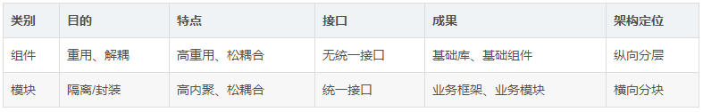

### 1.ROS兼容

RoboMasterOSS 是基于ROS2的，提供了很多__ROS2 metaPackage (Stack)__项目，针对robomaster比赛，集成了一些开发的基本工具，并提供了一些开发功能包，以及开发样例，以达到加速开发的目的。

正因为基于ROS2，所以可以获得ROS/ROS2的相关优势：

* 可使用ROS2自带调试工具，方便调试。
* 无缝对接其他ROS2开源项目，加快项目开发。

> ROS (Robot Operating System, 机器人操作系统) 提供一系列程序库和工具以帮助软件开发者创建机器人应用软件。它提供了硬件抽象、设备驱动、函数库、可视化工具、消息传递和软件包管理等诸多功能。（来自wiki.ros.org）
>

### 2.扩展能力

采用了模块化和组件化设计，对于RoboMaster OSS中的大部分ROS2功能包，即可以作为一个节点单独工作，也可以作为一个库被依赖，支持ROS2二次开发。

* 乐高特性：作为节点单独运行，像搭建乐高一样，构建自己的应用。
* 局部DIY特性：作为一个库被依赖，可以使得修改复用部分模块，进行局部DIY设计，而不需要从头开始。

> 组件化与模块化
>
>  

RoboMasterOSS提供相关基础组件以及部分功能组件。基础组件可以进行复用，达到加快开发的目的，使开发者专注于算法开发，甚至可以利用这些组件搭建一个完整的机器人软件demo。

### 3.丰富的内容

RoboMaster OSS 不仅仅是一个Software Stack，也是一个Technology Stack。RoboMasterOSS目标是提供：

* RoboMaster相关软件栈，如相机，通信，自瞄等功能模块，可供选择，进行快速开发。
* RoboMaster算法技术文档，不仅仅是代码，包含相关技术文档，方便解读代码，以及进行自己的优化与调整。
* RoboMaster开发指南，包含RoboMasterOSS相关项目使用文档，以及基于RoboMasterOSS的完整机器人开发案例与开发流程，非常适合新手快速上手。

